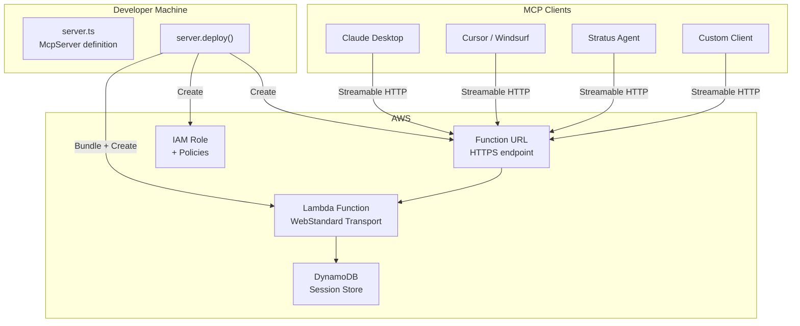
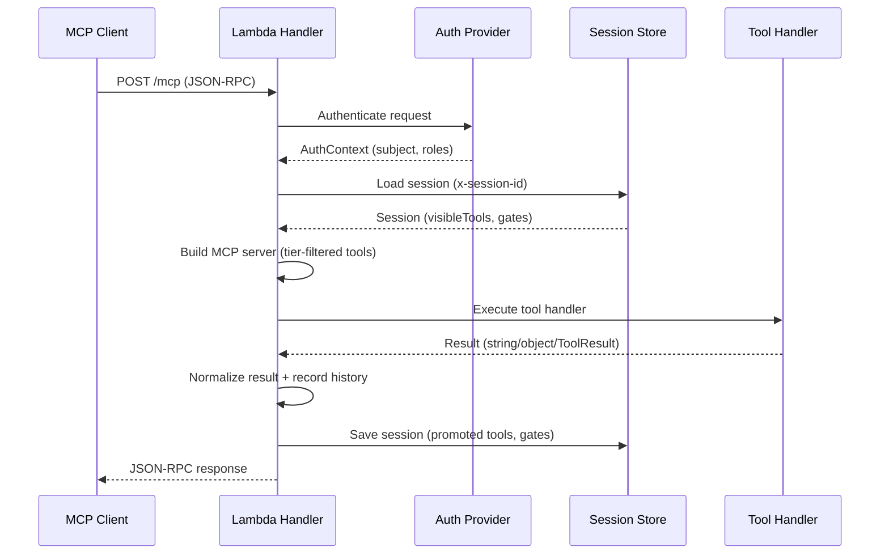
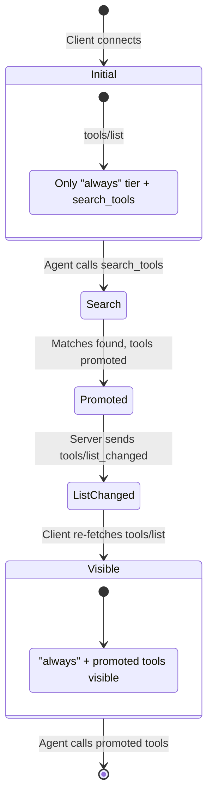

`@usestratus/mcp-aws` is a TypeScript library for building MCP servers that deploy to AWS. Progressive disclosure, tool gating, code mode, and one-line Lambda deploys.

<Callout type="info">
`@usestratus/mcp-aws` wraps the official `@modelcontextprotocol/sdk` — it adds AWS deployment, auth, gating, progressive disclosure, and observability on top of the standard MCP protocol.
</Callout>

## Architecture



## Request Flow



## Progressive Disclosure Flow



## Install

```bash tab="bun"
bun add @usestratus/mcp-aws zod@4
```

```bash tab="npm"
npm install @usestratus/mcp-aws zod@4
```

## Quick Start

```ts title="server.ts"
import { McpServer } from "@usestratus/mcp-aws";
import { z } from "zod";

const server = new McpServer("my-tools@1.0.0")
  .tool("greet", z.object({ name: z.string() }), async ({ name }) => {
    return `Hello, ${name}!`;
  });

// Lambda handler
export const handler = server.lambda();

// Or deploy from code
const { url } = await server.deploy({ entry: "./src/server.ts" });
```

Five lines to a working MCP server on Lambda.

<Callout>
Looking for the agent SDK? See [Getting Started](/getting-started) for `stratus-sdk`.
</Callout>

## What It Does

| Feature | Description |
|---|---|
| [Tool registration](/mcp-aws/tools) | Zod schemas, auto-coerced returns, method chaining |
| [Progressive disclosure](/mcp-aws/progressive-disclosure) | 3-tier system so agents only see relevant tools |
| [Tool gating](/mcp-aws/gating) | Role, prerequisite, rate limit, and composite gates |
| [Code mode](/mcp-aws/code-mode) | Agent writes code that calls tools — N calls in 1 round-trip |
| [Auth](/mcp-aws/auth) | API key, Cognito JWT, chainable providers |
| [Deploy](/mcp-aws/deploy) | One-line Lambda deploy with VPC and IAM auth options |
| [Sessions](/mcp-aws/sessions) | Memory, DynamoDB, and SQLite stores for per-session state |
| [Observability](/mcp-aws/observability) | Typed events for tool calls, gate denials, promotions |
| [Security](/mcp-aws/security) | SSRF protection, VPC isolation, RFC 9728 OAuth metadata |

## Constructor

```ts title="server.ts"
// String form — parses "name@version"
const server = new McpServer("my-server@1.0.0");

// Config object — for advanced options
const server = new McpServer({
  name: "my-server",
  version: "1.0.0",
  codeMode: { enabled: true, executor: "worker" },
});
```

## Transports

Same server, five deploy targets:

```ts title="transports.ts"
// Lambda (serverless)
export const handler = server.lambda();

// Bun.serve (zero dependencies, native)
const { url, stop } = server.bun({ port: 3000 });

// Express (container, ECS, EC2)
server.express().setup(app);

// Stdio (local dev, Claude Desktop)
await server.stdio();

// Raw handler (Bun.serve, Deno.serve, any Web Standard runtime)
import { createMcpHandler } from "@usestratus/mcp-aws";
const handler = createMcpHandler({ createServer: () => myServer });
```

## Method Chaining

Everything returns `this`:

```ts title="chain.ts"
const server = new McpServer("my-server@1.0.0")
  .auth(apiKey({ "sk-123": { roles: ["admin"] } }))
  .tool("ping", async () => "pong")
  .tool("greet", z.object({ name: z.string() }), async ({ name }) => `Hello, ${name}!`)
  .on("tool:call", (e) => console.log(e.toolName));
```
